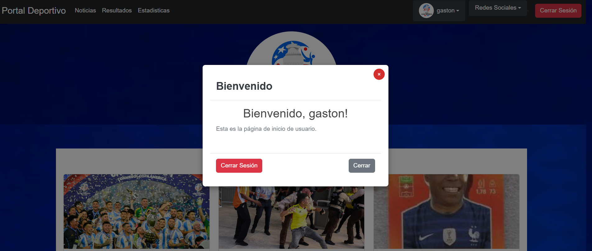

# **Copa América Voting Platform**

## **Descripción del Proyecto**

La **Copa América Voting Platform** es una aplicación web que permite a los usuarios votar por el mejor jugador y el mejor equipo de la Copa América. Además, ofrece una sección de noticias actualizadas sobre el torneo. La plataforma cuenta con funcionalidades de registro, inicio de sesión, votaciones seguras y visualización de estadísticas en tiempo real, todo en una interfaz amigable y moderna.

---

## **Características Principales**

### **1. Inicio de sesión y registro**
- **Registro de usuarios:** Se solicita nombre, correo electrónico, teléfono y contraseña.
- **Inicio de sesión:** Validación de credenciales antes de acceder a las funcionalidades de votación.

### **2. Noticias**
- **Sección dedicada:** Los usuarios pueden consultar noticias actualizadas sobre la Copa América.
- **Diseño atractivo:** Las noticias están organizadas con titulares de diferentes tamaños, destacando las más importantes.
- **Contenido dinámico:** Actualizaciones en tiempo real sobre resultados, jugadores destacados y novedades del torneo.

### **3. Votaciones**
- **Mejor jugador:** Los usuarios pueden seleccionar y votar por su jugador favorito.
- **Mejor equipo:** También pueden votar por el equipo que consideran el mejor.
- **Prevención de votos duplicados:** Cada usuario puede emitir un solo voto por categoría.

### **4. Estadísticas**
- Visualización de los resultados de las votaciones en tiempo real.
- Gráficos interactivos para mostrar la cantidad de votos acumulados por jugadores y equipos.

### **5. Interfaz amigable**
- Diseño **responsivo** que se adapta a dispositivos móviles, tabletas y computadoras.
- Navegación fluida entre secciones como la página principal, noticias, votaciones y estadísticas.

---

## **Vista Previa**

### **Página Principal**
_Descripción de la página principal, donde los usuarios pueden explorar las secciones de noticias, votación y estadísticas._

### **Sección de Noticias**
_Espacio dinámico con noticias destacadas del torneo._

### **Página de Usuario**
_Página personalizada que permite a los usuarios registrados acceder a las funcionalidades de votación._

### **Votación de Jugador**
_Interfaz para seleccionar y votar por el mejor jugador de la Copa América._

### **Estadísticas**
_Visualización gráfica de los votos para jugadores y equipos._

---

## **Requisitos**
- **Backend:** Python 3, Flask, Flask-MySQLdb, Flask-Login.
- **Frontend:** HTML, CSS, Bootstrap, JavaScript.
- **Base de datos:** MySQL.

---

### **Nota**
Este proyecto está diseñado para proporcionar una experiencia fluida y accesible a los usuarios interesados en participar en las votaciones y mantenerse informados sobre la Copa América.
